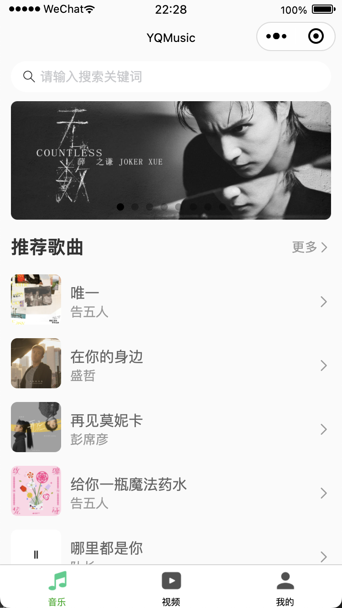

## 小程序实战之音乐项目

> 前言: 仿照coderwhy老师的音乐项目, 编写的移动端小程序云音乐项目, 如果觉得不错，或者对你有帮助, 可以点一个star; 数据来源于网易云开源的接口, 接口来自于coderwhy老师的部署。

### 1.项目简介

项目已经完成功能如下：（你可以clone下来自己体验一下）

#### 1.1. 音乐页面

> 轮播图和推荐歌曲展示

> 推荐歌单展示

> 排行榜展示

#### 1.2. 歌曲-歌单列表

> 音乐界面中, 点击推荐歌曲、推荐歌单或者排行榜，分别会进入歌曲列表展示和歌单列表展示；歌单列表中也可以点击进入歌曲列表

#### 1.3. 播放页面

> 点击歌曲进入播放页面, 同事播放歌曲

> 播放页面功能: 
>
> - 歌曲进度条控制
>
> - 切换顺序播放、单曲循环、随机播放
> - 上一首下一首功能实现
> - 播放与暂停功能

> 展示歌词:
>
> - 根据歌曲进度, 展示不同的歌词

> 退出播放页面时, 在底部展示当前播放歌曲

#### 1.4. 视频页面

> 展示歌曲MV视频(目前只有前20*条数据的视频有数据*)

> 点击视频进入播放页面, 播放视频

#### 1.5. 我的页面

> 我的页面是集成云开发, 实现功能如下: 
>
> - 登录功能
> - 展示我的收藏、我的喜欢、历史记录歌曲
> - 创建歌单、删除歌单、添加歌曲到歌单

### 2.项目规范

**项目中有一些开发规范和代码风格**

- 1.文件夹、文件名称统一小写、多个单词以连接符（-）连接；
- 2.JavaScript变量名称采用小驼峰标识，常量全部使用大写字母，组件采用大驼峰；
- 3.CSS采用普通CSS和styled-component结合来编写（全局采用普通CSS、局部采用styled-component）;
- 其他规范在项目中根据实际情况决定和编写；